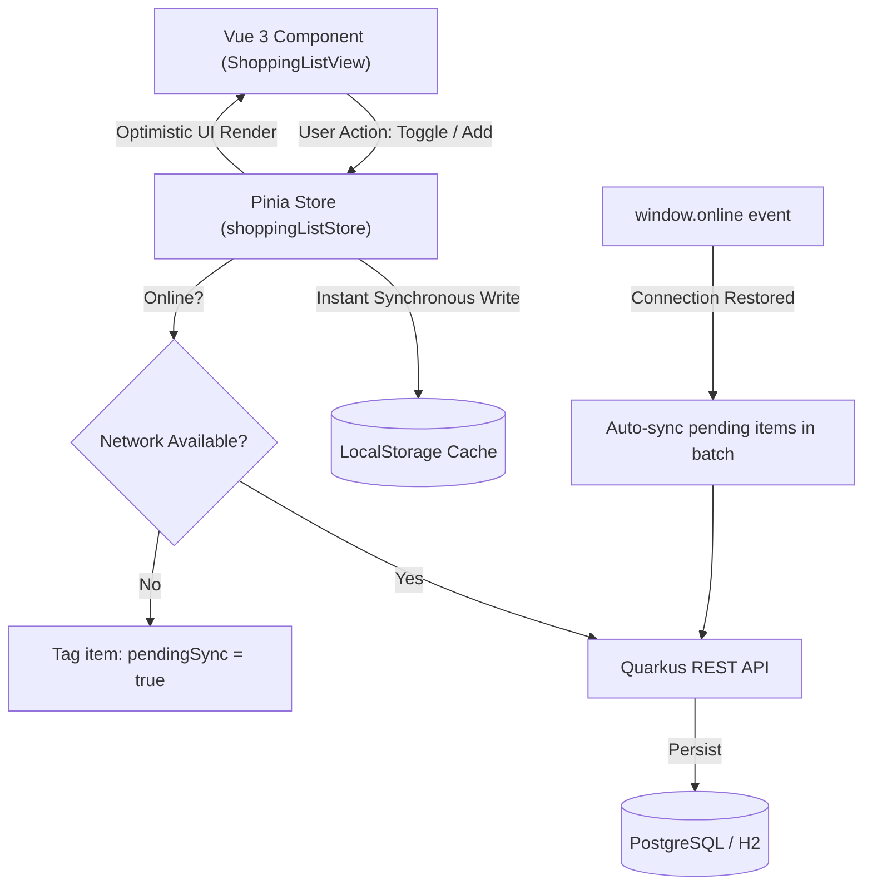

# Skafferiet (Recipe & Pantry Sync)

[](https://github.com/PoppzyOne/recipe-pantry-sync/actions/workflows/ci.yml)

> A modern, lightweight, full-stack application for managing recipes, weekly meal planning, pantry inventory, and an **offline-first** synchronized shopping list that works reliably even inside grocery stores with poor cellular coverage.

---

## 📖 Overview

**Skafferiet** ("The Pantry") bridges the gap between home cooking and grocery shopping. It helps households minimize food waste and meal planning stress by connecting:
1. **What you want to cook** (Weekly meal planner & recipe database).
2. **What you already have** (Real-time pantry inventory).
3. **What you actually need to buy** (Automated shopping list with volume/weight deduction and offline local persistence).

---

## ✨ Key Features

### 🍲 Recipe Management
- Store recipes with preparation/cooking times, customizable servings, and categorized ingredient lists.
- **Stock Comparison:** Instantly see which ingredients you already have at home and which are missing for each recipe.
- One-click addition of missing ingredients to your shopping list.

### 📅 Weekly Meal Planner
- Intuitive weekly grid (Monday–Sunday) with Swedish calendar formatting and ISO week number calculations.
- Plan Breakfast, Lunch, Dinner, or Snacks using recipes from your collection or custom free-form dishes.
- Adjustable servings per meal with automatic ingredient scaling.
- **Generate Shopping List:** Aggregates ingredients across the entire week, converts units (`g` $\leftrightarrow$ `kg`, `ml` $\leftrightarrow$ `cl` $\leftrightarrow$ `dl` $\leftrightarrow$ `l` $\leftrightarrow$ `msk` $\leftrightarrow$ `tsk` $\leftrightarrow$ `krm`), deducts current pantry stock, and warns if items are already on your shopping list.
- Fast offline caching via `localStorage` so your meal schedule is accessible anytime.

### 🛒 Offline-First Smart Shopping List
- **Zero-Latency In-Store Experience:** Checking off items or adding goods occurs optimistically with 0 ms UI delay, persisting straight to browser storage.
- **Background Synchronization:** Seamlessly syncs changes to the Quarkus backend when an internet connection is available.
- **Auto-Reconnect Sync:** Listens for browser network status transitions and pushes queued offline additions (`pendingSync`) automatically upon reconnecting.
- **Smart Merging:** Automatically combines amounts when identical unchecked items are added.
- **Aisle Categorization:** Items are grouped by grocery category (*Produce, Dairy, Meat, Pantry, Spices, Bakery, Frozen, Other*) for efficient store navigation.
- **Sync to Pantry:** With a single click, purchased items are transferred directly into your pantry inventory and cleared from the shopping list.

### 🌾 Pantry Inventory Tracking
- Track goods by quantitative amounts (`g`, `kg`, `dl`, `l`, `st`, etc.) or qualitative fill levels (*Full*, *Half-full*, *Low*).
- Filter by category, stock status (*In Stock* vs. *Out of Stock*), or text search.
- Quick in-stock toggling.

---

## 🛠️ Tech Stack & Architecture

### Backend
- **Language & Runtime:** Java 21, [Quarkus 3.39](https://quarkus.io/) (High-performance, low-memory cloud-native framework)
- **Persistence:** Hibernate ORM with Panache (Repository pattern)
- **Database Migrations:** Flyway (`V1.0.0` through `V1.0.3`)
- **Databases:**
  - PostgreSQL 16 (Default / Containerized production profile)
  - H2 Database (Fast in-memory storage for local `%dev` and `%test` profiles)
- **Validation:** Jakarta Bean Validation (`@NotNull`, `@NotBlank`, `@Positive`, `@Size`)
- **API Documentation:** SmallRye OpenAPI & Swagger UI
- **Architecture Pattern:** Resource (REST Controller) $\rightarrow$ Service $\rightarrow$ Repository / Entity. Java `record`s are strictly used for all incoming and outgoing DTOs.

### Frontend
- **Framework:** [Vue 3](https://vuejs.org/) (Composition API with `<script setup lang="ts">`)
- **Language:** TypeScript 5 (Strict type safety across API interfaces and stores)
- **Build Tool:** [Vite 8](https://vite.dev/)
- **State Management:** [Pinia](https://pinia.vuejs.org/) (Optimistic updates & `localStorage` caching)
- **Styling:** [Tailwind CSS v4](https://tailwindcss.com/)
- **Testing:** [Vitest](https://vitest.dev/) with JSDOM

---

## 📁 Repository Structure

```text
recipe-pantry-sync/
├── backend/
│   ├── src/main/java/com/recipesync/
│   │   ├── dto/            # Immutable Java records for requests and responses
│   │   ├── entity/         # JPA entities (Recipe, PantryItem, MealPlanItem, ShoppingListItem)
│   │   ├── repository/     # Panache repositories
│   │   ├── resource/       # JAX-RS / RESTful endpoints
│   │   └── service/        # Domain business logic & unit conversions
│   ├── src/main/resources/
│   │   ├── db/migration/   # Versioned Flyway SQL migrations (V1.0.0 - V1.0.3)
│   │   └── application.properties # Profile configurations (%dev, %test, prod)
│   ├── src/test/java/      # Integration test suite (56 tests)
│   └── Dockerfile          # Multi-stage JVM container build
├── frontend/
│   ├── src/
│   │   ├── api/            # Type-safe fetch API clients (Recipe, Pantry, MealPlan, ShoppingList)
│   │   ├── components/     # Vue 3 UI components & modals
│   │   ├── stores/         # Pinia reactive state stores with offline persistence
│   │   ├── types/          # TypeScript domain interfaces matching backend DTOs
│   │   └── App.vue         # Main single-page application layout & tab navigation
│   ├── src/__tests__/      # Vitest unit test suite
│   ├── vite.config.ts      # Vite config with API proxy for local development
│   └── Dockerfile          # Multi-stage build served via Nginx
├── docker-compose.yml      # Multi-container orchestration (PostgreSQL, Backend, Frontend)
├── .env.example            # Template for environment variables
└── README.md               # Project documentation
```

---

## 🚀 Getting Started

### Prerequisites
- **Java:** JDK 21+
- **Build Tool:** Maven 3.9+ (or use `./mvnw` if installed)
- **Node.js:** v20+ and `npm`
- **Docker:** (Optional, for containerized PostgreSQL or full compose deployment)

---

### Option 1: Quickstart with Docker Compose

To launch the complete application stack (PostgreSQL + Quarkus Backend + Vue Frontend) in containers:

1. Clone the repository and navigate into the folder:
   ```bash
   git clone git@github.com:PoppzyOne/recipe-pantry-sync.git
   cd recipe-pantry-sync
   ```

2. Start all services:
   ```bash
   docker compose up --build
   ```

3. Access the applications:
   - **Frontend App:** [http://localhost:3000](http://localhost:3000)
   - **Backend API:** [http://localhost:8080](http://localhost:8080)
   - **Swagger UI:** [http://localhost:8080/swagger-ui](http://localhost:8080/swagger-ui)
   - **OpenAPI Spec:** [http://localhost:8080/openapi](http://localhost:8080/openapi)

---

### Option 2: Local Development (Hot Reloading)

For rapid development with instant live reload on both frontend and backend:

#### 1. Start Backend in Dev Mode
The backend automatically spins up an in-memory H2 database pre-seeded with sample data from `import.sql`:

```bash
cd backend
mvn quarkus:dev
```
*Backend runs on `http://localhost:8080` (with live reload on code changes).*

#### 2. Start Frontend Dev Server
In a separate terminal:

```bash
cd frontend
npm install
npm run dev
```
*Frontend runs on `http://localhost:5173` and automatically proxies `/api` calls to port `8080`.*

---

## 🧪 Testing

### Backend Test Suite
The backend contains 56 integration tests running in an isolated H2 test profile verifying validation constraints, edge cases, unit conversion, and transaction boundaries:

```bash
cd backend
mvn test
```

### Frontend Validation & Tests
Run type checking, unit tests, and production build verification:

```bash
cd frontend

# 1. TypeScript compilation check
npm run type-check

# 2. Vitest unit tests
npm run test:unit -- --run

# 3. Production asset bundle build
npm run build
```

---

## 📡 REST API Reference

All endpoints accept and return `application/json`. Detailed interactive documentation is available via **Swagger UI** at `/swagger-ui`.

| Endpoint | Method | Description |
| :--- | :--- | :--- |
| **Recipes** | | |
| `/api/recipes` | `GET` | List all recipes (optionally filtered by category/search) |
| `/api/recipes/{id}` | `GET` | Get recipe by ID with ingredients |
| `/api/recipes` | `POST` | Create a new recipe |
| `/api/recipes/{id}` | `PUT` | Update recipe |
| `/api/recipes/{id}` | `DELETE` | Delete recipe |
| `/api/recipes/{id}/missing-ingredients` | `GET` | Check ingredients missing compared to current pantry stock |
| **Pantry** | | |
| `/api/pantry` | `GET` | List pantry items (optionally filter by `inStock=true`) |
| `/api/pantry` | `POST` | Add or update pantry item |
| `/api/pantry/{id}` | `PUT` | Update quantity, unit, or stock status |
| `/api/pantry/{id}/toggle-stock` | `PATCH` | Quick toggle of in-stock status |
| `/api/pantry/{id}` | `DELETE` | Remove pantry item |
| **Meal Plans** | | |
| `/api/meal-plans` | `GET` | List meal plans within date range (`?startDate=...&endDate=...`) |
| `/api/meal-plans` | `POST` | Plan a meal (recipe or custom title) |
| `/api/meal-plans/{id}` | `PUT` | Update planned meal date, servings, or notes |
| `/api/meal-plans/{id}` | `DELETE` | Delete planned meal |
| `/api/meal-plans/shopping-list` | `GET` | Calculate missing ingredients across date range with pantry deduction |
| **Shopping List** | | |
| `/api/shopping-list` | `GET` | List all items (ordered: unchecked first) |
| `/api/shopping-list` | `POST` | Add item (merges quantity if identical item exists) |
| `/api/shopping-list/batch` | `POST` | Bulk add multiple items in a single request |
| `/api/shopping-list/{id}` | `PUT` | Update item details or check status |
| `/api/shopping-list/{id}/toggle` | `PATCH` | Toggle checked status |
| `/api/shopping-list/{id}` | `DELETE` | Remove item |
| `/api/shopping-list/completed` | `DELETE` | Clear all checked items |
| `/api/shopping-list/sync-to-pantry` | `POST` | Move checked items to pantry stock & remove from list |

---

## 📶 Offline-First Architecture

Poor cellular reception is common in brick-and-mortar grocery stores. To prevent frustration, **Skafferiet** implements an offline-first state strategy:



1. **Optimistic UI:** Every action updates the Pinia state and browser `localStorage` synchronously. The user never waits on a network response spinner to check off an item.
2. **Background Sync:** If connected to the network, updates are asynchronously dispatched to the backend.
3. **Graceful Degrade:** If network requests fail or offline mode is detected, items are tagged with `pendingSync`.
4. **Auto-Reconciliation:** When the device regains network access, `window.addEventListener('online')` automatically pushes queued offline mutations and fetches the authoritative server state.

---

## 📄 License

This project is licensed under the [MIT License](LICENSE).
